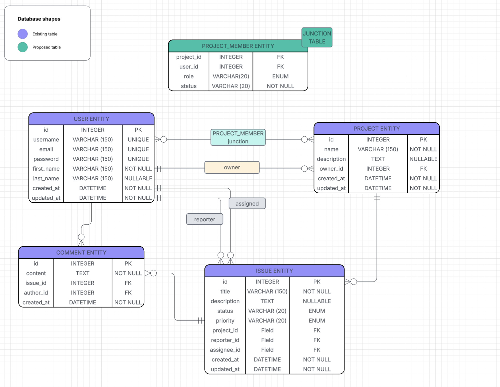
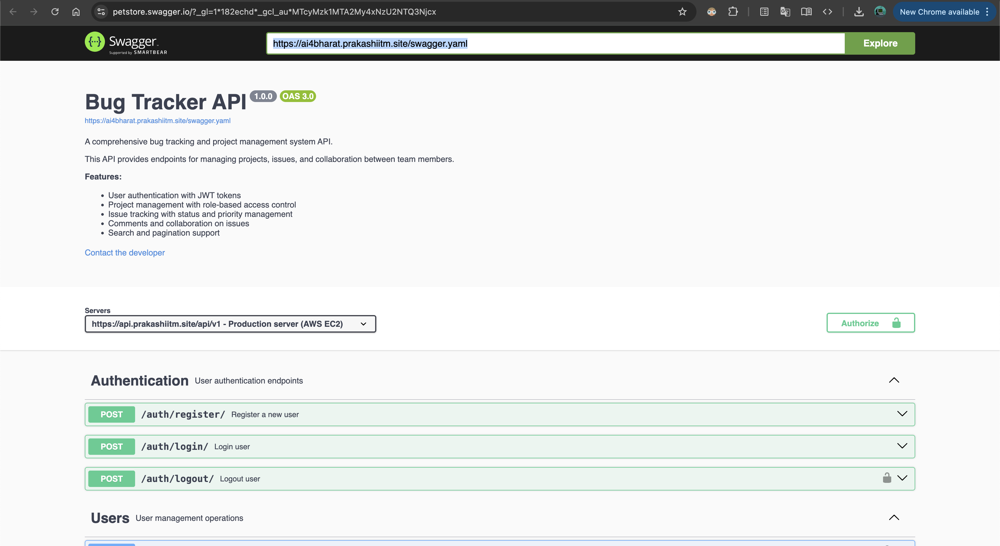

# Bug Tracker Application

A comprehensive bug tracking and project management system built with Django REST Framework (Backend) and React + TypeScript (Frontend).

## Features

- **User Authentication**: JWT-based authentication with secure login and registration
- **Project Management**: Create, update, and manage multiple projects
- **Issue Tracking**: Track bugs and issues with customizable status and priority levels
- **Comments & Collaboration**: Add comments to issues for team collaboration
- **Search & Pagination**: Search issues by keywords and navigate through paginated results
- **Role-Based Access**: Project owners and members with different permission levels
- **Professional UI**: Clean, modern interface with sharp design elements

## Architecture

### Backend
- **Framework**: Django 5.2.6 with Django REST Framework
- **Authentication**: JWT tokens (Simple JWT)
- **Database**: SQLite (development), PostgreSQL-ready for production
- **API Documentation**: OpenAPI 3.0 (Swagger)
- **Deployment**: Docker containerized, deployed on AWS EC2

### Frontend
- **Framework**: React 19.1.1 with TypeScript
- **Routing**: React Router v7
- **State Management**: React Context API
- **HTTP Client**: Axios with interceptors
- **Notifications**: React Hot Toast
- **Build Tool**: Vite

## Database Schema



[View ER Diagram](./ER_DIAGRAM.png)

The database schema includes the following main entities:
- **Users**: Custom user model with authentication
- **Projects**: Project management with ownership
- **Project Members**: Many-to-many relationship between users and projects
- **Issues**: Bug/issue tracking with status and priority
- **Comments**: Threaded comments on issues

## Prerequisites

### Backend Requirements
- Python 3.11+
- pip (Python package manager)
- Virtual environment (recommended)

### Frontend Requirements
- Node.js 18+ and npm/yarn
- Modern web browser

### Deployment Requirements (Optional)
- Docker
- AWS Account with EC2 instance

## Setup Instructions

### Backend Setup

1. **Clone the repository**
   ```bash
   cd /path/to/intern_project
   ```

2. **Navigate to backend directory**
   ```bash
   cd backend
   ```

3. **Create and activate virtual environment**
   ```bash
   python -m venv venv

   # On macOS/Linux
   source venv/bin/activate

   # On Windows
   venv\Scripts\activate
   ```

4. **Install dependencies**
   ```bash
   pip install -r requirements.txt
   ```

5. **Run migrations**
   ```bash
   cd app
   python manage.py migrate
   ```

6. **Create superuser (optional)**
   ```bash
   python manage.py createsuperuser
   ```

7. **Run development server**
   ```bash
   python manage.py runserver
   ```

   The backend API will be available at `http://localhost:8000/api/v1/`

8. **Access Django Admin** (optional)
   - URL: `http://localhost:8000/admin/`
   - Login with superuser credentials

### Frontend Setup

1. **Navigate to frontend directory**
   ```bash
   cd frontend
   ```

2. **Install dependencies**
   ```bash
   npm install
   ```

3. **Configure environment variables**

   Create a `.env` file in the frontend directory:
   ```env
   VITE_API_BASE_URL=http://localhost:8000/api/v1
   ```

   For production, use:
   ```env
   VITE_API_BASE_URL=https://api.prakashiitm.site/api/v1
   ```

4. **Run development server**
   ```bash
   npm run dev
   ```

   The frontend will be available at `http://localhost:5173/`

5. **Build for production**
   ```bash
   npm run build
   ```

## Docker Deployment

### Build Docker Image

```bash
cd backend
docker build --platform linux/amd64 -t proprak/bug-tracker-backend:latest .
```

### Push to Docker Hub

```bash
docker push proprak/bug-tracker-backend:latest
```

### Run Docker Container Locally

```bash
docker run -p 8000:8000 proprak/bug-tracker-backend:latest
```

## AWS EC2 Deployment

The backend is currently deployed on AWS EC2 with the following configuration:

### Deployment Details
- **Instance Type**: t2.micro (or similar)
- **Platform**: Amazon Linux 2 / Ubuntu
- **Container**: Docker
- **Domain**: api.prakashiitm.site
- **SSL**: HTTPS enabled (recommended)

### EC2 Deployment Steps

1. **Launch EC2 Instance**
   - Choose Amazon Linux 2 or Ubuntu AMI
   - Configure security group to allow HTTP (80), HTTPS (443), and SSH (22)

2. **Connect to EC2 Instance**
   ```bash
   ssh -i your-key.pem ec2-user@your-instance-ip
   ```

3. **Install Docker**
   ```bash
   # Amazon Linux 2
   sudo yum update -y
   sudo yum install docker -y
   sudo service docker start
   sudo usermod -a -G docker ec2-user

   # Ubuntu
   sudo apt update
   sudo apt install docker.io -y
   sudo systemctl start docker
   sudo systemctl enable docker
   sudo usermod -aG docker ubuntu
   ```

4. **Pull and Run Docker Container**
   ```bash
   docker pull proprak/bug-tracker-backend:latest
   docker run -d -p 8000:8000 --name bug-tracker proprak/bug-tracker-backend:latest
   ```

5. **Configure Nginx (Optional)**

   For HTTPS and reverse proxy:
   ```bash
   sudo apt install nginx -y
   ```

   Edit `/etc/nginx/sites-available/default`:
   ```nginx
   server {
       listen 80;
       server_name api.prakashiitm.site;

       location / {
           proxy_pass http://localhost:8000;
           proxy_set_header Host $host;
           proxy_set_header X-Real-IP $remote_addr;
           proxy_set_header X-Forwarded-For $proxy_add_x_forwarded_for;
           proxy_set_header X-Forwarded-Proto $scheme;
       }
   }
   ```

6. **Setup SSL with Let's Encrypt (Recommended)**
   ```bash
   sudo apt install certbot python3-certbot-nginx -y
   sudo certbot --nginx -d api.prakashiitm.site
   ```

7. **Restart Nginx**
   ```bash
   sudo systemctl restart nginx
   ```

## API Documentation

API documentation is available in Swagger/OpenAPI 3.0 format:

- **Swagger File**: [`swagger.yaml`](./swagger.yaml)
- **Live API**: `https://api.prakashiitm.site/api/v1/`

### Accessing Swagger Documentation



To view the interactive API documentation:

1. Go to [https://editor.swagger.io](https://editor.swagger.io)
2. Click on **"File"** → **"Import URL"**
3. Enter the URL: `https://ai4bharat.prakashiitm.site/swagger.yaml`
4. The interactive documentation will load, allowing you to explore and test all API endpoints

### Key API Endpoints

#### Authentication
- `POST /auth/register/` - Register new user
- `POST /auth/login/` - Login user
- `POST /auth/logout/` - Logout user

#### Projects
- `GET /projects/` - List all projects
- `POST /projects/` - Create new project
- `GET /projects/{id}/` - Get project details
- `PATCH /projects/{id}/` - Update project
- `DELETE /projects/{id}/` - Delete project

#### Issues
- `GET /projects/{projectId}/issues/` - List project issues (with search & pagination)
- `POST /projects/{projectId}/issues/` - Create new issue
- `GET /projects/{projectId}/issues/{issueId}/` - Get issue details
- `PATCH /projects/{projectId}/issues/{issueId}/` - Update issue
- `DELETE /projects/{projectId}/issues/{issueId}/` - Delete issue

#### Comments
- `GET /projects/{projectId}/issues/{issueId}/comments/` - List comments
- `POST /projects/{projectId}/issues/{issueId}/comments/` - Add comment
- `PATCH /projects/{projectId}/issues/{issueId}/comments/{commentId}/` - Update comment
- `DELETE /projects/{projectId}/issues/{issueId}/comments/{commentId}/` - Delete comment

## Authentication

The API uses JWT (JSON Web Tokens) for authentication:

1. Register or login to receive access and refresh tokens
2. Include the access token in the Authorization header:
   ```
   Authorization: Bearer <your_access_token>
   ```
3. Tokens are automatically managed by the frontend

## Project Structure

```
intern_project/
├── backend/
│   ├── app/
│   │   ├── app/              # Django project settings
│   │   ├── users/            # User management app
│   │   ├── projects/         # Project management app
│   │   ├── issues/           # Issue tracking app
│   │   ├── api/              # API configuration
│   │   └── manage.py
│   ├── requirements.txt
│   └── Dockerfile
├── frontend/
│   ├── src/
│   │   ├── components/       # Reusable components
│   │   ├── context/          # React context providers
│   │   ├── pages/            # Page components
│   │   ├── services/         # API service layer
│   │   ├── types/            # TypeScript types
│   │   └── App.tsx
│   ├── package.json
│   └── vite.config.ts
├── swagger.yaml              # API documentation
├── ER_DIAGRAM.png            # Database schema
└── README.md
```

## Testing

### Backend Tests
```bash
cd backend/app
python manage.py test
```

### Frontend Tests
```bash
cd frontend
npm run test
```

## Environment Variables

### Backend (.env)
```env
DEBUG=True
SECRET_KEY=your-secret-key
ALLOWED_HOSTS=localhost,127.0.0.1,api.prakashiitm.site
CORS_ALLOW_ALL_ORIGINS=True
```

### Frontend (.env)
```env
VITE_API_BASE_URL=https://api.prakashiitm.site/api/v1
```

## Issue Status & Priority

### Status Options
- `open` - Issue is newly created
- `in_progress` - Issue is being worked on
- `resolved` - Issue has been fixed
- `closed` - Issue is closed

### Priority Levels
- `low` - Minor issues
- `medium` - Regular issues
- `high` - Important issues
- `critical` - Urgent issues requiring immediate attention

## Contributing

1. Fork the repository
2. Create a feature branch (`git checkout -b feature/AmazingFeature`)
3. Commit your changes (`git commit -m 'Add some AmazingFeature'`)
4. Push to the branch (`git push origin feature/AmazingFeature`)
5. Open a Pull Request

## License

This project is licensed under the MIT License.

## Team

- **Developer**: Prakash Kumar Jha
- **Contact**: prakashkumarjha@example.com

## Bug Reports

If you find any bugs, please create an issue in this repository with:
- Bug description
- Steps to reproduce
- Expected behavior
- Screenshots (if applicable)

## Support

For support and questions:
- Email: support@bugtracker.com
- GitHub Issues: Create an issue in this repository

## Version History

- **v1.0.0** (Current)
  - Initial release
  - User authentication with JWT
  - Project and issue management
  - Comments functionality
  - Search and pagination
  - Professional UI redesign
  - AWS EC2 deployment with Docker

## Acknowledgments

- Django REST Framework for the robust backend framework
- React and Vite for the modern frontend development experience
- AWS for reliable cloud infrastructure
- Docker for containerization
